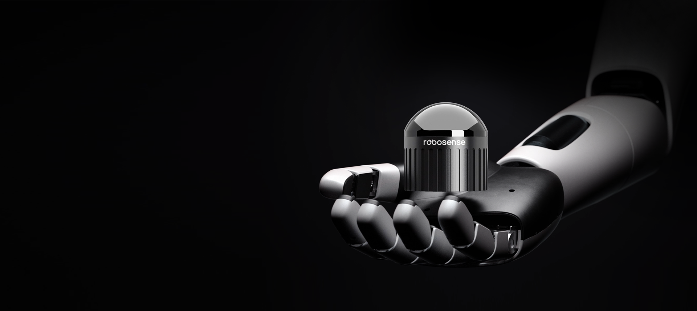
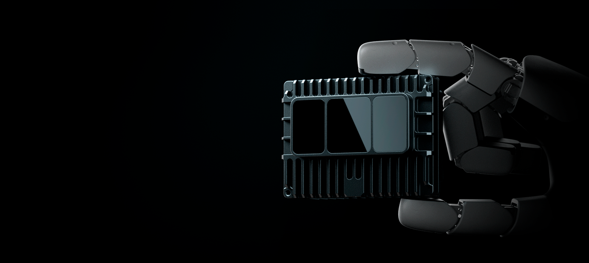

# 传感器
## Active Camera

## Airy

面向机器人市场，Robosense推出新一代半球形机械式激光雷达，突出小型化、轻量级特征，充分考虑了移动机器人对导航、避障等感知需求，通过独特的光机系统设计，以乒乓球大小的尺寸提供了水平 360°、垂直 90° 的超广半球形 FOV，最远检测距离达到 60m，支持 192 线，兼容室内外场景，赋能机器人进入全场景智能化的新时代。  
点击了解详情：[Airy](https://www.robosense.ai/rslidar/Airy)

## E1R

Robosense 基于量产车规级激光雷达平台，面向机器人市场设计的扁平窗口纯固态激光雷达，内部无任何运动部件，兼顾探测性能、成本优势和可靠性，具有水平 120°、垂直 90° 超广角 FOV，最远检测距离达到 75m，支持 144 线，可助力机器人从容应对雨水、沙尘等严苛环境。  
点击了解详情：[E1R](https://www.robosense.ai/rslidar/E1R)